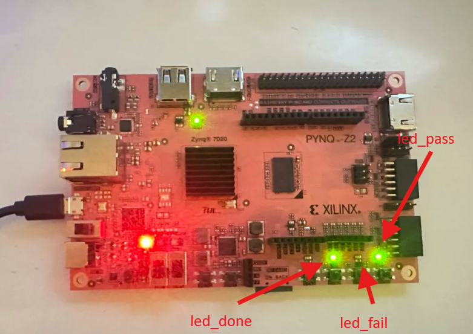
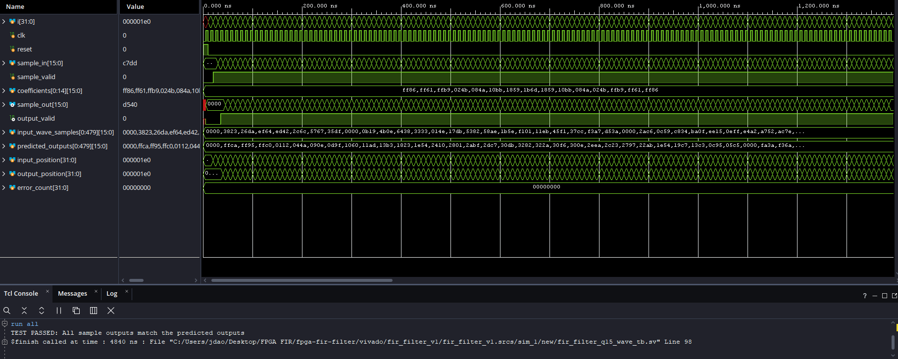
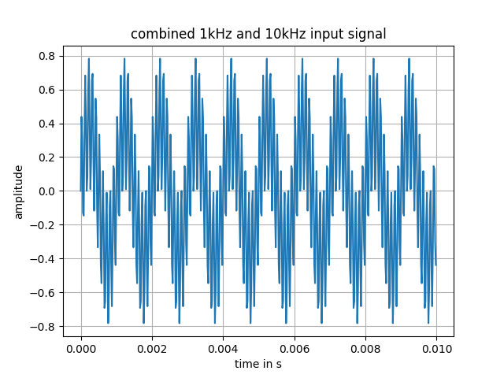
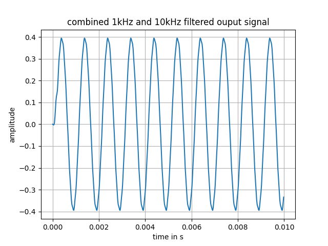
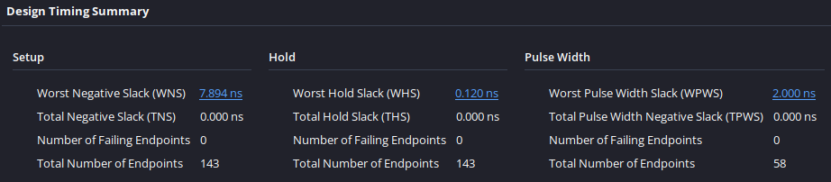
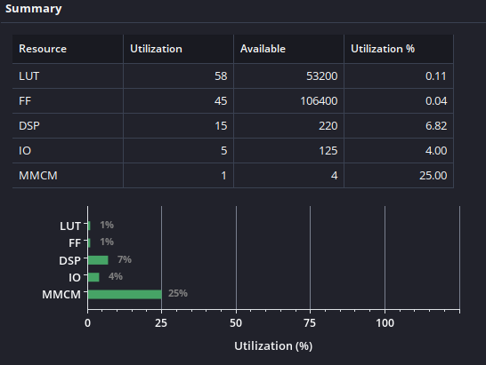

# FPGA FIR Filter

A 15-tap Q1.15 FIR low-pass filter implemented using SystemVerilog, verified with a Python reference model, and deployed on a PYNQ-Z2 FPGA.

## Key Results

- Accepts one signed 16-bit input sample per clock cycle
- Passed a 480-sample two-tone test with zero mismatches
- Verified using self-checking SystemVerilog testbenches in Vivado
- Deployed and verified on a PYNQ-Z2 at 25 MHz
- Passed timing with positive setup and hold slack
- Uses 15 DSP blocks, 58 LUTs and 45 flip-flops



## Overview

This project describes a finite impulse response low-pass filter in SystemVerilog. The FIR system uses 15 coefficients which are generated from its sample rate and cutoff frequency. The design uses Vivado where it is synthesized and implemented. Then, the converted bitstream is loaded onto an FPGA (PYNQ-Z2).

A 16-bit signed sample is fed into a filter one clock cycle at a time and the system stores all the recent samples into an internal array `sample_delay`. Each of the 15 samples will be multiplied by its corresponding coefficient and all products in the end are summed up to produce a filtered output.

The design implements Q1.15 fixed point formatting for its samples and coefficients. This format converts fractional numbers to 16-bit signed integers for simpler hardware calculations. Using Python, a reference model was made to generate the appropriate coefficients and predicted outputs to verify against the SystemVerilog implementation.

## Architecture

### Python Reference Model

First, a set of parameters must be defined. These parameters are the sample rate, the cutoff frequency and the # of taps. The `firwin` function from the SciPy API is called with these defined parameters to generate the coefficients.

```
sample_rate = 48000
cutoff_frequency = 5000
number_of_taps = 15

coefficients = firwin(
    number_of_taps,
    cutoff_frequency,
    fs=sample_rate,
    window="hamming"
)
```

Note: Setting window to 'hamming' gradually reduces the two endpoints of its impulse response. This reduces ripples, but trades off cutoff sharpness.

The reference model then generates a test signal. Two sine waves are combined which contain 1 kHz and 10 kHz components respectively. The signal and coefficients are then converted to Q1.15 before being processed by a fixed-point Python FIR model. The input samples and predicted outputs are exported to `.mem` files and will be used to verify the SystemVerilog implementation.

### FIR Processing Core

The SystemVerilog FIR processing core accepts one signed 16-bit sample whenever `sample_valid` is equal to 1. Each accepted sample enters an internal 15-element delay array called `sample_delay`. Every time a new sample is received, it begins at index zero for which the previous samples will be shifted to subsequent indexes.

The processor calculates the output by multiplying each sample with its matching coefficient. Then it sums all 15 products.

$$
y[n] = \sum_{k=0}^{14} h[k]x[n-k]
$$

`x[n-k]` = delayed sample input and
`h[k]` = filter coefficient.

Calculating the product of a coefficient and a sample (both format Q1.15) produces a result with 30 fractional bits. The accumulated result is arithmetically shifted to the right by 15 bits which converts it back to Q1.15. The result is saturated to a signed 16-bit range to prevent undesirable overflow from wrapping around. `output_valid` indicates when `sample_out` contains a completed output.

### FPGA Top Level System

The top-level module controls the FPGA clock, reset, test samples, LEDs and output verification. The FIR core is instantiated inside the top-level module which connects the FPGA board and filter together. Clocking Wizard handles the conversion of the PYNQ-Z2's 125 MHz input clock to an appropriate 25 MHz clock to the FIR system.

The input samples and predicted outputs calculations from the Python reference model are loaded as .mem files into two internal memory arrays. While the test is running, the top-level controller feeds an input sample to the FIR core per clock cycle with 'sample_valid' equal to 1. Whenever the FIR core asserts `output_valid`, the produced sample is compared with its corresponding expected output.

After 480 samples have all been processed, the top-level module uses three different LEDs to display the test result. The `led_done` output indicates that the test has finished, while `led_pass` or `led_fail` indicates whether every FPGA output matched the Python reference model.

The reset button is configured with a reset_pipe which allows for an asynchronous assertion and a synchronous deassertion. Pressing it causes all LEDs to turn off (indicating the test has restarted).

## Verification and Results

### Impulse Response Test

`fir_filter_q15_tb`: A standard impulse response test was first used to verify the appropriate calculation with the delay sample order and the coefficient multiplication. The input starts with a max positive Q1.15 sample of 32767 followed by 14 samples with values of 0. The results match with the predicted outputs with proper Q1.15 formatting. The testbench reported zero mismatches.

### Two-Tone Test

`fir_filter_q15_wave_tb`: A signal test similar to that of the Python reference model was performed using 480 samples from a combined signal of 1 kHz and 10 kHz sine waves. The reference model generated the input samples and the predicted Q1.15 outputs which were loaded as .mem files into the Vivado testbench. The testbench reported zero mismatches.



The filtered output retained the 1 kHz frequency component whilst the 10 kHz component was attenuated, which demonstrates an expected behavior of the 5 kHz low-pass filter.

#### Input Signal



#### Filtered Output Signal



## Synthesis and FPGA Deployment

The design was synthesized and implemented in Vivado for the PYNQ-Z2's XC7Z020 FPGA. A Clocking Wizard converted the board's 125 MHz clock into a 25 MHz clock for the FIR system. After implementation, the design passed timing with positive setup and hold slack.



The generated bitstream was programmed onto the PYNQ-Z2. The onboard test processed all 480 samples and compared the results against the Python reference model. The `led_done` and `led_pass` outputs turned on with the `led_fail` turned off, confirming that the hardware test completed without any mismatches.

### Resource Utilization



From resource utilization, the design uses 15 DSP blocks, 58 LUTs and 45 flip-flops. This correlates correctly since the 15 DSP blocks corresponds with the 15 parallel coefficient multiplications in the FIR filter. One MMCM is from the Clocking Wizard which converts PYNQ-Z2's 125 MHz input clock to the 25 MHz system clock.

## How to Run

### Python Reference Model

```bash
python -m pip install numpy scipy matplotlib
```

- Required python libraries

```bash
python python/generate_coefficients.py
python python/test_filter.py
```

- Runs the coefficient generator + test scripts from repository root
- These scripts generate the appropriate Q1.15 coefficients, input samples, predicted outputs and signal plots with the `.mem` files stored in `data/` directory

### Vivado Simulation

1. Open the file `vivado/fir_filter_v1/fir_filter_v1.xpr`.
2. Set `fir_filter_q15_tb` as simulation top to run the impulse response test.
3. Run Behavioral Simulation and confirm that the console reports zero mismatches.
4. Set `fir_filter_q15_wave_tb` as the simulation top to run the 480-sample two-tone test.
5. Run Behavioral Simulation again and confirm that the test passes with zero mismatches.

### FPGA Deployment

1. Set `fir_filter_q15_fpga_top` as the design top module.
2. Ensure that `pynq_z2_fir_demo.xdc` is enabled.
3. Run synthesis and implementation.
4. Generate the bitstream.
5. Connect and power on the PYNQ-Z2 to the computer.
6. Click "Open Hardware Manager", then "Open Target" and select XC7Z020 as the device and program it using the generated bitstream.
7. Confirm `led_done` and `led_pass` are turned on with `led_fail` being turned off.
8. Press the reset button to clear the LEDs and restart the onboard test.
